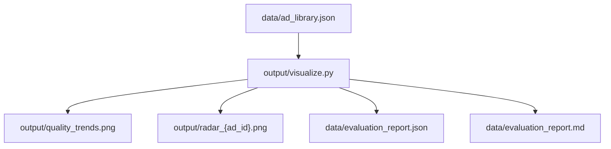

# Phase 10: Visualize -- Quality Trends and Dashboards

## Context

All prior phases are complete. The project has 53 ad records in [data/ad_library.json](data/ad_library.json) and batch metrics in [data/batch_summary.json](data/batch_summary.json). No visualization code exists yet. `matplotlib` and `plotly` are in [requirements.txt](requirements.txt); `seaborn` is not, but the matplotlib built-in style `seaborn-v0_8-whitegrid` covers the styling needs without the package.

The single deliverable is [output/visualize.py](output/visualize.py).

---

## What Gets Built

### 1. `plot_quality_trends()` -- 2x2 subplot figure

Loads all `AdRecord`s from `data/ad_library.json` and produces a 2x2 matplotlib figure saved to `output/quality_trends.png`:

- **Top-left: Avg aggregate score per iteration cycle** (line chart). Group ads by `iteration_cycle` (1, 2, 3), compute mean score at each cycle. Red dashed line at 7.0 threshold.
- **Top-right: Score distribution per dimension** (grouped bar chart). 5 bars showing average score for each dimension (clarity, value_prop, CTA, brand_voice, emotional_resonance).
- **Bottom-left: Pass rate by audience segment** (bar chart). % of ads per segment that passed threshold. Data already in `batch_summary.json` but will recompute from raw records for accuracy.
- **Bottom-right: Cost per ad by iteration count** (bar chart). Group ads by their `iteration_cycle` value, compute average total cost (gen + eval) per group.

Style: `plt.style.use('seaborn-v0_8-whitegrid')`, tight layout, `figsize=(14, 10)`.

### 2. `plot_dimension_radar(ad_record)` -- spider chart per ad

Creates a radar/spider chart for one ad's 5 dimension scores. Saves to `output/radar_{ad_id}.png`. Uses matplotlib polar projection -- no extra deps needed.

### 3. `generate_evaluation_report()` -- JSON + markdown

Produces two files:

- `**data/evaluation_report.json`**: total ads, pass rate, average score, per-dimension averages and standard deviations, per-segment pass rates, total/per-ad/per-passing-ad cost, quality improvement (avg score at cycle 1 vs final cycle).
- `**data/evaluation_report.md**`: human-readable version of the same stats, with a short narrative summary.

### 4. CLI entry point

`__main`__ block that runs all three functions in sequence:

1. `plot_quality_trends()`
2. `plot_dimension_radar()` for the top-scoring and bottom-scoring ad
3. `generate_evaluation_report()`

Prints paths of all generated files to stdout.

---

## Data Flow

---

## Key Implementation Notes

- Reuse `AdRecord` from [generate/models.py](generate/models.py) for type-safe loading (same pattern as `load_ad_library()` in [output/batch_runner.py](output/batch_runner.py))
- `iteration_cycle` on each record reflects how many cycles that specific ad went through (1 = passed first try, 2 = one retry, 3 = two retries). For the "score per iteration cycle" chart, we need to consider that ads with `improved_from` show cycle-over-cycle improvement; the chart should show average *final* score grouped by how many cycles were needed
- Standard deviation for dimension scores uses `statistics.stdev` (stdlib)
- Radar chart uses `matplotlib.pyplot.subplot(polar=True)` with numpy for angle computation -- numpy is a transitive dep of matplotlib
- No need to add seaborn to `requirements.txt` -- the style string is baked into matplotlib

## Existing Code to Leverage

- `load_ad_library()` from [output/batch_runner.py](output/batch_runner.py) -- loads `AdRecord` list from JSON
- `SEGMENT_LABELS` and `DIMENSION_LABELS` from [output/generate_report.py](output/generate_report.py) -- reuse for consistent label formatting

