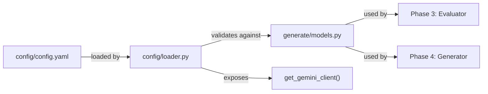

# Phase 2: Define -- Data Models and Configuration

## What We're Building

Three files that form the data backbone for all subsequent phases:




---

## Step 2.1: config/config.yaml

Create verbatim from the build guide (lines 228-284). Key sections:

- **models** -- `gemini-3.1-pro-preview` for both generator and evaluator
- **quality** -- threshold `7.0`, max 3 regeneration attempts
- **dimensions** -- 5 dimensions with weights summing to 1.0 (clarity 0.25, value_proposition 0.25, call_to_action 0.20, brand_voice 0.15, emotional_resonance 0.15), each with description and score anchors
- **brand** -- Varsity Tutors voice guidelines and 3 audience segments
- **seed** -- 42

No deviations from the guide here.

---

## Step 2.2: generate/models.py

Pydantic v2 models. Six models total:

1. **AdBrief** -- Generator input. Fields: `audience_segment` (str), `product` (str, default "sat_prep"), `campaign_goal` (Literal["awareness", "conversion"]), `tone` (Optional[str]), `specific_offer` (Optional[str])
2. **GeneratedAd** -- Generator output. Fields: `primary_text` (str, max 300 chars), `headline` (str, max 40 chars), `description` (str, max 125 chars), `cta_button` (Literal["Learn More", "Sign Up", "Get Started", "Book Now", "Try Free"])
3. **DimensionScore** -- Single dimension eval. Fields: `score` (int, ge=1, le=10), `rationale` (str), `confidence` (Literal["low", "medium", "high"])
4. **AdEvaluation** -- Full evaluation with computed fields:
  - 5 dimension fields (DimensionScore each)
  - `aggregate_score` (computed: weighted average using dimension weights)
  - `passes_threshold` (computed: aggregate >= 7.0)
  - `weakest_dimension` (computed: name of lowest-scoring dimension)
  - Weights default to the config values but the computed field needs them passed in or hardcoded. Cleanest approach: accept a `dimension_weights` dict at construction via `model_config`, or compute with hardcoded defaults matching config.yaml, overridable later.
5. **AdRecord** -- Complete ad record. Fields: `ad_id` (str), `brief` (AdBrief), `generated_ad` (GeneratedAd), `evaluation` (AdEvaluation), `iteration_cycle` (int), `improved_from` (Optional[float]), `improvement_strategy` (Optional[str]), `generation_cost_usd` (float), `evaluation_cost_usd` (float), `timestamp` (datetime)
6. **Config** -- YAML config model with nested sub-models for `models`, `quality`, `dimensions`, `brand`, and `seed`. Classmethod `from_yaml(path)` that loads and validates.

### CTA Mismatch

The calibration ads in [compete/references/calibration_ads.json](compete/references/calibration_ads.json) use CTAs like "Book a Tutor" and "Match With a Top 5% Tutor" that aren't in the `GeneratedAd.cta_button` Literal. This is fine -- `GeneratedAd` constrains what the *generator* produces (Meta's standard buttons). The calibration ads represent *reference* data with free-form CTAs. No change needed to the model; the calibration loader in Phase 3 will read those as raw strings, not as `GeneratedAd` instances.

### Computed Fields Implementation

Use `@computed_field` with `@property` from Pydantic v2. For `aggregate_score`, hardcode the default weights (matching config.yaml) directly in the model since the weights are part of the project's core scoring contract. If config weights change, update both places -- or accept weights as an init param with defaults.

```python
DEFAULT_WEIGHTS = {
    "clarity": 0.25,
    "value_proposition": 0.25,
    "call_to_action": 0.20,
    "brand_voice": 0.15,
    "emotional_resonance": 0.15,
}

@computed_field
@property
def aggregate_score(self) -> float:
    scores = {
        "clarity": self.clarity.score,
        "value_proposition": self.value_proposition.score,
        "call_to_action": self.call_to_action.score,
        "brand_voice": self.brand_voice.score,
        "emotional_resonance": self.emotional_resonance.score,
    }
    return round(sum(scores[d] * DEFAULT_WEIGHTS[d] for d in scores), 2)
```

---

## Step 2.3: config/loader.py

- Load `config/config.yaml` with PyYAML, validate against `Config` model
- Load `.env` via `python-dotenv`
- `get_config() -> Config` -- singleton (module-level cache with `functools.lru_cache` or simple global)
- `get_gemini_client() -> genai.Client` -- returns `genai.Client(api_key=os.getenv("GOOGLE_API_KEY"))`
- Graceful errors: if config.yaml missing, clear message; if API key missing, clear message

---

## Verification

After creating all 3 files, verify with:

```bash
python3 -c "
from config.loader import get_config, get_gemini_client
config = get_config()
print(f'Model: {config.models.generator}')
print(f'Threshold: {config.quality.threshold}')
print(f'Dimensions: {list(config.dimensions.keys())}')
client = get_gemini_client()
print('Config and client loaded successfully!')
"
```

