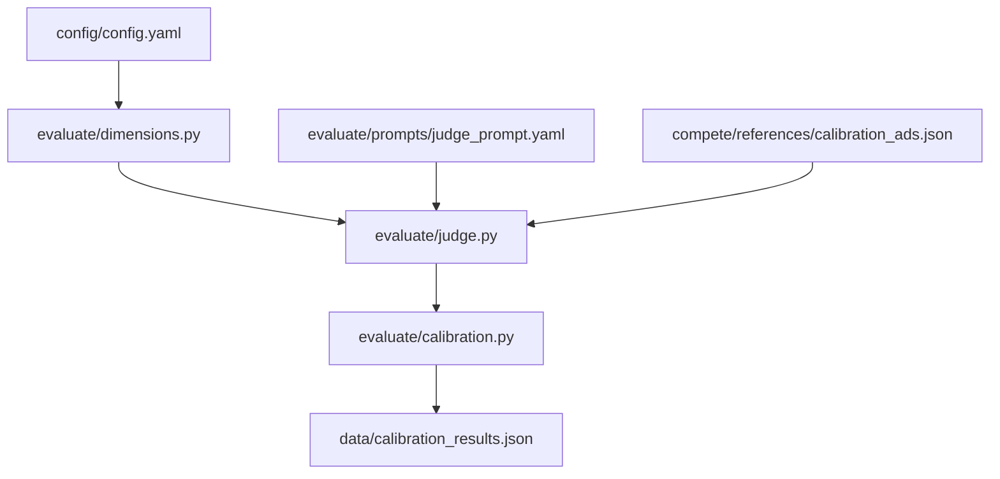

# Phase 3: Evaluate -- Build the Judge First

## What We're Building

Four files that form the evaluation backbone. The evaluator must run and pass calibration before we proceed to Phase 4 (generator).




## Existing Code We Build On

- [config/config.yaml](config/config.yaml) -- 5 dimension definitions with `weight`, `description`, `score_1`, `score_10`
- [generate/models.py](generate/models.py) -- `GeneratedAd`, `DimensionScore`, `AdEvaluation`, `Config`
- [config/loader.py](config/loader.py) -- `get_config()`, `get_gemini_client()`
- [compete/references/calibration_ads.json](compete/references/calibration_ads.json) -- 8 calibration ads (3 high, 3 medium, 2 low) with per-dimension expected scores

---

## Step 3.1: `evaluate/dimensions.py`

Reads the 5 dimension definitions from config and expands them into detailed scoring rubrics. Each rubric is a multi-line string that gets injected into the judge prompt.

- `get_rubric(dimension_name: str) -> str` -- returns a rubric with:
  - What the dimension measures (from `config.dimensions[name].description`)
  - Score 1 anchor (from `config.dimensions[name].score_1`) with a concrete bad-ad example
  - Score 5 anchor (interpolated -- "mediocre middle ground" specific to Varsity Tutors SAT context)
  - Score 10 anchor (from `config.dimensions[name].score_10`) with a concrete great-ad example
  - Common mistakes that tank the score (e.g., for `call_to_action`: bare "Learn More" with no embedded action)
- `get_all_rubrics() -> dict[str, str]` -- returns all 5

The rubrics should be hardcoded but built on top of the config anchors. They're SAT-prep-specific: reference "Varsity Tutors", "digital SAT", "parent/student audience", etc. The calibration ads' `notes` fields are a goldmine for rubric specificity (e.g., cal_07's notes explain why repeated identical text = clarity 4).

---

## Step 3.2: `evaluate/prompts/judge_prompt.yaml`

Create the directory `evaluate/prompts/` and the prompt template file. This is mostly verbatim from the build guide (lines 366-420 of adenginebuildguide.md) with `system` and `user` keys.

Template variables in the `user` section:

- `{primary_text}`, `{headline}`, `{description}`, `{cta_button}` -- from the ad being evaluated
- `{dimension_name}`, `{dimension_rubric}` -- from dimensions.py
- `{high_reference}`, `{low_reference}` -- from calibration_ads.json

Expected response format: JSON with `thinking`, `score`, `rationale`, `confidence`.

---

## Step 3.3: `evaluate/judge.py`

The core judge module. Two main functions:

`**evaluate_dimension(ad, dimension_name, rubric, high_ref, low_ref) -> tuple[DimensionScore, dict]**`

- Loads prompt template from `evaluate/prompts/judge_prompt.yaml`
- Fills template variables
- Calls Gemini (`config.models.evaluator` = `gemini-3.1-pro-preview`) with `temperature=0`
- Parses JSON response into `DimensionScore`
- On invalid JSON: retry once, then fallback `DimensionScore(score=5, rationale="Evaluation failed -- parse error", confidence="low")`
- Returns the score + `{"input_tokens": ..., "output_tokens": ...}` dict

`**evaluate_ad(ad, config) -> tuple[AdEvaluation, dict]**`

- Loops over all 5 dimensions, calling `evaluate_dimension` for each
- Loads rubrics from `dimensions.py`
- Picks high/low reference ads from calibration_ads.json (filter by `expected_quality`)
- Assembles `AdEvaluation` (computed fields handle aggregate_score, passes_threshold, weakest_dimension)
- Prints a `rich` table: dimension | score | confidence | rationale snippet
- Returns the evaluation + aggregated token usage / cost dict

**Design notes:**

- The calibration ads have free-form CTAs ("Book a Tutor", "Match With a Top 5% Tutor") that don't fit the `GeneratedAd` Literal. The judge reads calibration ads as raw dicts for reference examples, not as `GeneratedAd` instances.
- Cost tracking: Gemini 3.1 Pro pricing -> estimate from token counts (can use approximate values, Langfuse will track exact costs later in Phase 6).

---

## Step 3.4: `evaluate/calibration.py`

Runnable as `python -m evaluate.calibration`. Tests the judge against all 8 calibration ads.

- Loads calibration_ads.json
- For each ad, constructs a dict-like ad object and runs `evaluate_ad()`
- Compares evaluator scores against `expected_score_range` and `dimension_expectations`
- Calibration pass criteria:
  - High-quality ads (cal_01-03) must score aggregate 7.5+
  - Medium-quality ads (cal_04-06) must score aggregate 4.5-7.5
  - Low-quality ads (cal_07-08) must score below 5.0
- Prints calibration report with:
  - Per-ad: expected vs actual aggregate + per-dimension deltas
  - Overall: PASSED / FAILED
  - Specific fix suggestions if miscalibrated (e.g., "evaluator scores low-quality ads too high on emotional_resonance -- add more negative examples to the rubric")
- Saves results to `data/calibration_results.json`

**Note:** Since calibration ads have free-form CTAs that don't match the `GeneratedAd` Literal, we'll need a lightweight adapter -- either a separate `CalibrationAd` model or just pass the ad fields as a dict to the judge prompt formatter directly. Cleanest approach: create a small `ReferenceAd` model (or just use a dict) for calibration purposes, while `evaluate_dimension` accepts the individual text fields rather than requiring a full `GeneratedAd`.

---

## Verification

After building all 4 files:

```bash
python -m evaluate.calibration
```

Expected: a calibration report showing the judge can distinguish high/medium/low quality ads. If it fails, we iterate on the rubrics and prompt before moving to Phase 4.