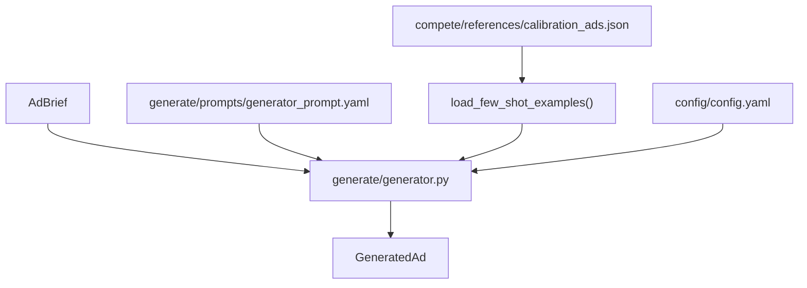

# Phase 4: Generate -- Ad Copy Pipeline

## What We're Building

Two new files that form the generation side of the system. The evaluator (Phase 3) already tells us what "good" looks like; now we build the thing that produces ads.




## Existing Code We Build On

- [generate/models.py](generate/models.py) -- `AdBrief`, `GeneratedAd`, `Config`, `BrandConfig`, `AudienceSegment`
- [config/loader.py](config/loader.py) -- `get_config()`, `get_gemini_client()`
- [config/config.yaml](config/config.yaml) -- `models.generator` = `gemini-3.1-pro-preview`, `brand.audience_segments` for mapping segment IDs to labels
- [compete/references/calibration_ads.json](compete/references/calibration_ads.json) -- 8 calibration ads (3 high-quality) for few-shot examples
- [evaluate/judge.py](evaluate/judge.py) -- reference for Gemini call pattern, JSON extraction, cost tracking conventions

---

## Step 4.1: Create `generate/prompts/generator_prompt.yaml`

Create the directory `generate/prompts/` and the prompt template file. Content comes directly from the build guide (lines 500-545).

Key details:

- `system` key: brand voice rules, ad format constraints, Meta best practices
- `user` key: template variables `{audience_description}`, `{campaign_goal}`, `{tone}`, `{specific_offer}`, `{hook_style}`, `{few_shot_examples}`
- Expected response format: JSON with `primary_text`, `headline`, `description`, `cta_button`

---

## Step 4.2: Create `generate/generator.py`

Three functions plus helpers, following the same patterns as `evaluate/judge.py` (YAML prompt loading, Gemini client from `config/loader.py`, JSON extraction with retry, cost tracking).

`**load_few_shot_examples(dimension: str | None = None) -> str**`

- Loads high-quality (`expected_quality == "high"`) ads from `calibration_ads.json`
- Formats 2-3 of them as labeled examples for prompt injection
- If `dimension` is specified, sort by that dimension's `dimension_expectations` score descending and pick top 2-3
- Returns a formatted string block like `EXAMPLE 1:\nPrimary Text: ...\nHeadline: ...\n...`

`**generate_ad(brief: AdBrief, config: Config, hook_style: str = "question", few_shot_examples: str = "") -> tuple[GeneratedAd, dict]**`

- Load prompt template from `generate/prompts/generator_prompt.yaml`
- Map `brief.audience_segment` to human label via `config.brand.audience_segments` (e.g., `anxious_parents` -> `"Parents anxious about college admissions"`)
- Fill template variables; use `brief.tone or config.brand.voice` for tone, `brief.specific_offer or ""` for offer
- Call Gemini using `config.models.generator` with `temperature=1.0`
- Extract JSON from response (reuse the regex-based approach from judge.py: look for `{...}` block)
- Parse into `GeneratedAd` via Pydantic
- On parse failure: retry once with `temperature=0.7`, then raise `ValueError`
- Return `(GeneratedAd, {"input_tokens": ..., "output_tokens": ..., "cost_usd": ...})`
- Print hook style + ad preview with `rich`

`**generate_ad_variants(brief: AdBrief, config: Config, num_variants: int = 4) -> list[tuple[GeneratedAd, dict]]**`

- Hook styles: `["question", "stat", "story", "fear"]`
- Generate one ad per hook style up to `num_variants`
- Auto-load few-shot examples via `load_few_shot_examples()`
- Return list of `(GeneratedAd, usage_dict)` tuples

**Helpers:**

- `_load_prompt_template() -> dict[str, str]` -- YAML loader with caching
- `_extract_json(text: str) -> dict` -- same regex pattern as judge.py
- `_estimate_cost(input_tokens, output_tokens) -> float` -- same pricing constants as judge.py

---

## Step 4.3: Quick Smoke Test

Run a quick inline test per the build guide to verify the generator produces valid `GeneratedAd` objects:

```python
from generate.generator import generate_ad
from generate.models import AdBrief
from config.loader import get_config

config = get_config()
brief = AdBrief(
    audience_segment="anxious_parents",
    campaign_goal="conversion",
    specific_offer="Free SAT practice test",
)
ad, usage = generate_ad(brief, config, hook_style="question")
```

This validates end-to-end: config loading, prompt templating, Gemini call, JSON parsing, Pydantic validation.