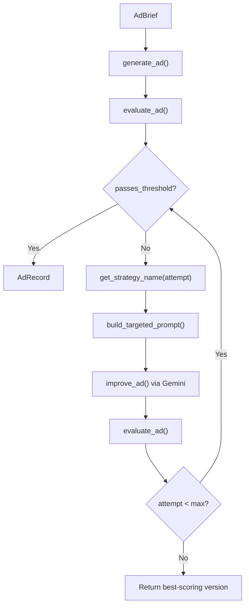

# Phase 5: Iterate -- The Feedback Loop

## What We're Building

Two new files in `iterate/` that connect the generator (Phase 4) and evaluator (Phase 3) into a closed loop: generate an ad, evaluate it, identify the weakest dimension, regenerate with targeted feedback, re-evaluate, repeat up to 3 times.




## Existing Code We Build On

- [generate/models.py](generate/models.py) -- `AdBrief`, `GeneratedAd`, `AdEvaluation` (with computed `weakest_dimension`, `passes_threshold`, `aggregate_score`), `AdRecord`, `Config` (with `quality.threshold=7.0`, `quality.max_regeneration_attempts=3`)
- [generate/generator.py](generate/generator.py) -- `generate_ad(brief, config, hook_style, few_shot_examples) -> (GeneratedAd, usage_dict)`, `load_few_shot_examples(dimension)`
- [evaluate/judge.py](evaluate/judge.py) -- `evaluate_ad(ad, config=None) -> (AdEvaluation, usage_dict)`. Note: `config` param is unused internally (calls `get_config()` itself)
- [config/loader.py](config/loader.py) -- `get_config()`, `get_gemini_client()`

Key patterns to reuse from existing code:

- JSON extraction via regex (`_extract_json` in both judge.py and generator.py)
- Cost estimation via `_estimate_cost(input_tokens, output_tokens)`
- `rich` console output for progress logging
- Gemini call pattern: `client.models.generate_content(model=..., contents=..., config={"system_instruction": ..., "temperature": ...})`

---

## Step 5.1: Create `iterate/strategies.py`

Three pure functions -- no LLM calls, just prompt construction.

`**get_strategy_name(attempt: int) -> str**`

- `1` -> `"targeted_reprompt"` -- tell the model what's weak
- `2` -> `"few_shot_injection"` -- add high-scoring examples for the weak dimension
- `3` -> `"model_escalation"` -- placeholder for future model upgrade (for now, same as few_shot_injection with stronger system instructions)

`**get_improvement_prompt(ad: GeneratedAd, evaluation: AdEvaluation, dimension_name: str) -> str**`

- Builds a basic improvement prompt: include the original ad text, state the weak dimension name/score/rationale, ask the model to rewrite improving that dimension while preserving strengths
- This is the "targeted_reprompt" strategy

`**build_targeted_prompt(original_ad: GeneratedAd, weak_dimension: str, score: int, rationale: str, strategy: str, config: Config) -> str**`

- For `"targeted_reprompt"`: calls `get_improvement_prompt` logic
- For `"few_shot_injection"`: same as targeted_reprompt PLUS injects 2-3 high-scoring examples from `load_few_shot_examples(dimension=weak_dimension)` (imported from `generate/generator.py`)
- For `"model_escalation"`: same as few_shot_injection with an added instruction like "You are the most senior creative director reviewing this ad. Be ruthless about quality."
- All strategies output the same JSON format as the generator (`primary_text`, `headline`, `description`, `cta_button`) so the response can be parsed into a `GeneratedAd`

---

## Step 5.2: Create `iterate/feedback.py`

Three functions that orchestrate the loop.

`**improve_ad(ad: GeneratedAd, evaluation: AdEvaluation, brief: AdBrief, config: Config, attempt: int = 1) -> tuple[GeneratedAd, dict[str, Any]]**`

- Gets `evaluation.weakest_dimension` and corresponding score/rationale
- Calls `get_strategy_name(attempt)` to pick strategy
- Calls `build_targeted_prompt(...)` to construct the prompt
- Calls Gemini via `get_gemini_client()` with the improvement prompt
- Uses the generator model (`config.models.generator`) since this is a generation task
- Parses response JSON into `GeneratedAd`, returns `(GeneratedAd, usage_dict)`
- `rich` output logging: strategy name, weak dimension, before/after preview

`**run_pipeline(brief: AdBrief, config: Config) -> AdRecord**`

- Step 1: `generate_ad(brief, config)` -- initial generation
- Step 2: `evaluate_ad(ad)` -- initial evaluation
- Step 3: Loop up to `config.quality.max_regeneration_attempts`:
  - If `evaluation.passes_threshold` -> break, create AdRecord, return
  - Else: `improve_ad(ad, evaluation, brief, config, attempt)` -> re-evaluate
  - Track the best version seen (highest `aggregate_score`)
- Step 4: After loop, return best version as `AdRecord`
- `AdRecord` fields: `ad_id` = UUID, `iteration_cycle` = number of cycles completed, `improved_from` = initial score if improvement happened, `improvement_strategy` = last strategy used, costs = sum of all gen + eval calls
- Print progress after each cycle: cycle number, aggregate score, weakest dimension, strategy

`**run_batch(briefs: list[AdBrief], config: Config) -> list[AdRecord]**`

- Iterates over briefs, calls `run_pipeline` for each
- Prints batch summary: total ads, pass rate, avg score, total cost
- Saves all `AdRecord` objects to `data/ad_library.json` (using Pydantic `.model_dump(mode="json")` for datetime serialization)
- Returns the list

---

## Step 5.3: Smoke Test

Run the inline test from the build guide to verify the full generate-evaluate-improve loop works end to end:

```python
from iterate.feedback import run_pipeline
from generate.models import AdBrief
from config.loader import get_config

config = get_config()
brief = AdBrief(
    audience_segment="anxious_parents",
    campaign_goal="conversion",
    specific_offer="Free SAT practice test",
)
record = run_pipeline(brief, config)
```

Verify: `record.evaluation.passes_threshold`, `record.iteration_cycle >= 1`, costs are tracked.