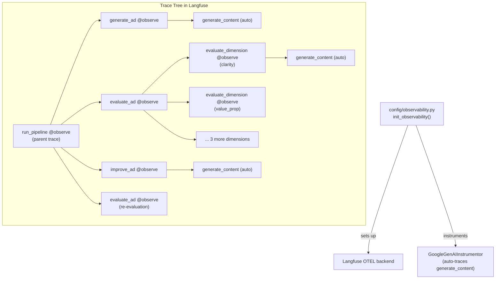

# Phase 6: Observe -- Langfuse Integration

## What We're Building

A new `config/observability.py` module that initializes Langfuse + OpenInference auto-instrumentation, plus `@observe()` decorators on all pipeline functions so every LLM call, evaluation, and improvement cycle appears as a nested trace in the Langfuse dashboard.




## Approach

Langfuse SDK v3 is OTEL-based. `@observe()` creates OTEL spans automatically. The `GoogleGenAIInstrumentor` from OpenInference also creates OTEL spans. Since both use the same global OTEL tracer provider, the auto-instrumented `generate_content` calls nest cleanly under the `@observe()` decorated function that invoked them.

---

## Step 6.1: Create [config/observability.py](config/observability.py)

New file with a single `init_observability()` function:

```python
from langfuse import get_client

def init_observability() -> bool:
    public_key = os.getenv("LANGFUSE_PUBLIC_KEY")
    secret_key = os.getenv("LANGFUSE_SECRET_KEY")
    if not public_key or not secret_key:
        # Warn and return; pipeline still works without observability
        return False
    
    get_client()  # initializes Langfuse OTEL pipeline
    GoogleGenAIInstrumentor().instrument()  # auto-trace all generate_content calls
    return True
```

- Gracefully no-ops if Langfuse env vars are missing (pipeline still works)
- Idempotent -- safe to call multiple times (Langfuse `get_client()` is a singleton, instrumentor checks if already instrumented)
- Call this once before any Gemini calls

---

## Step 6.2: Modify [config/loader.py](config/loader.py)

- Import `init_observability` from `config.observability`
- Call `init_observability()` at module load time (alongside existing `load_dotenv()`) so tracing is active before the first Gemini call

```python
from config.observability import init_observability
load_dotenv()
init_observability()
```

---

## Step 6.3: Modify [evaluate/judge.py](evaluate/judge.py)

Three changes:

1. Import `observe` from `langfuse` and `get_client` from `langfuse`
2. Decorate `evaluate_dimension()` with `@observe(name="evaluate-dimension")` -- after the call, update the current span with metadata (dimension_name, score, confidence)
3. Decorate `evaluate_ad()` with `@observe(name="evaluate-ad")` -- creates a parent span that nests all 5 dimension evaluations

Metadata to attach via `langfuse.update_current_span()`:

- `evaluate_dimension`: `{"dimension": dim_name, "score": score.score, "confidence": score.confidence}`
- `evaluate_ad`: `{"aggregate_score": agg, "passes_threshold": bool, "weakest_dimension": str}`

---

## Step 6.4: Modify [generate/generator.py](generate/generator.py)

1. Import `observe` from `langfuse`
2. Decorate `generate_ad()` with `@observe(name="generate-ad")` -- attach metadata: `{"hook_style": hook_style, "audience_segment": brief.audience_segment, "campaign_goal": brief.campaign_goal}`

---

## Step 6.5: Modify [iterate/feedback.py](iterate/feedback.py)

This is the most important file -- `run_pipeline` becomes the root trace.

1. Import `observe`, `propagate_attributes`, `get_client` from `langfuse`
2. Decorate `improve_ad()` with `@observe(name="improve-ad")` -- metadata: `{"strategy": strategy, "weak_dimension": weak_dim, "attempt": attempt}`
3. Decorate `run_pipeline()` with `@observe(name="run-pipeline")` -- this is the parent trace. Inside, use:

```python
   with propagate_attributes(
       tags=["pipeline"],
       metadata={"audience_segment": brief.audience_segment, "campaign_goal": brief.campaign_goal},
   ):
   

```

1. Decorate `run_batch()` with `@observe(name="run-batch")`. Inside, use:

```python
   with propagate_attributes(session_id=batch_id, tags=["batch"]):
   

```

   At the end, call `get_client().flush()` to ensure all traces are sent before the script exits.

---

## Step 6.6: Verify

Run the quick test from the build guide:

```python
from iterate.feedback import run_pipeline
from generate.models import AdBrief
from config.loader import get_config

config = get_config()
brief = AdBrief(audience_segment="anxious_parents", campaign_goal="conversion")
record = run_pipeline(brief, config)

from langfuse import get_client
get_client().flush()
```

Then check the Langfuse dashboard for a trace with nested spans.

---

## Dependencies

The existing `requirements.txt` already has:

- `langfuse>=3.0.0`
- `openinference-instrumentation-google-genai>=0.1.0`

These should pull in `opentelemetry-sdk` and related OTEL packages transitively. If they don't, we add `opentelemetry-sdk` and `opentelemetry-exporter-otlp-proto-http` to requirements.txt.

## LLM Call Sites (3 total)


| File                        | Function                                   | Decorator                             |
| --------------------------- | ------------------------------------------ | ------------------------------------- |
| `evaluate/judge.py:117`     | `evaluate_dimension` -> `generate_content` | `@observe(name="evaluate-dimension")` |
| `generate/generator.py:136` | `generate_ad` -> `generate_content`        | `@observe(name="generate-ad")`        |
| `iterate/feedback.py:86`    | `improve_ad` -> `generate_content`         | `@observe(name="improve-ad")`         |


