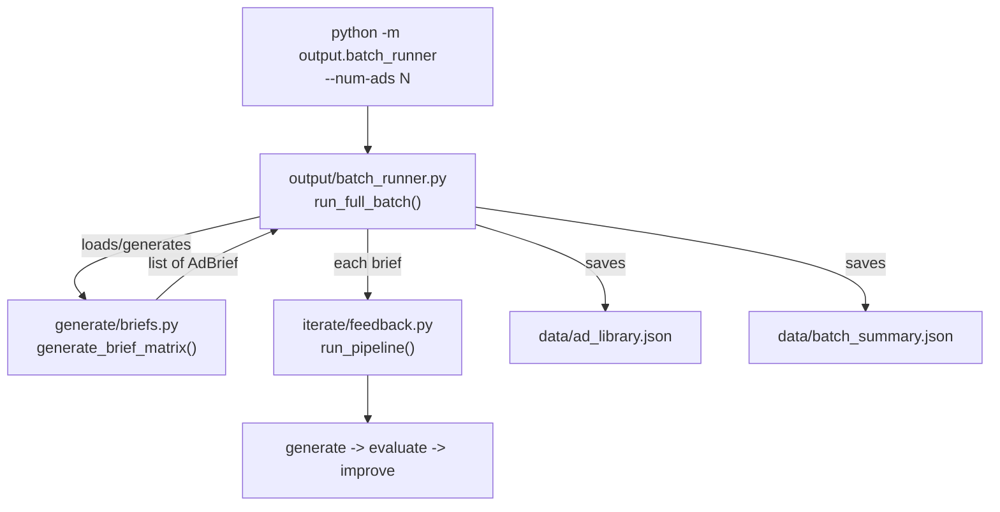

# Phase 7: Scale -- Batch Generation and Quality Trends

## What We're Building

Two new files that sit on top of the existing pipeline:

1. **[generate/briefs.py](generate/briefs.py)** -- Brief matrix generator (combinatorial + tone variation)
2. **[output/batch_runner.py](output/batch_runner.py)** -- CLI batch orchestrator with progress bar, rate-limit retry, and summary persistence

No existing files need modification. Both new modules import from the existing stack:

- `generate/models.py` -- `AdBrief`, `AdRecord`, `Config`
- `iterate/feedback.py` -- `run_pipeline`, `run_batch`
- `config/loader.py` -- `get_config`




---

## Step 7.1: Create [generate/briefs.py](generate/briefs.py)

New file with three public functions:

### `generate_brief_matrix() -> list[AdBrief]`

Combinatorial expansion of:

- 3 audience segments: `anxious_parents`, `stressed_students`, `comparison_shoppers` (from `config.brand.audience_segments`)
- 2 campaign goals: `awareness`, `conversion`
- 3 offers: `"Free SAT practice test"`, `"1-on-1 expert tutoring"`, `"Score improvement guarantee"`
- 3 tones: `"urgent"`, `"empathetic"`, `"confident"`

That's 3 x 2 x 3 x 3 = **54 unique briefs**. The function should:

- Use `itertools.product` for clean combinatorial generation
- Accept optional `config: Config` param to read audience segments from config rather than hardcoding
- Return the full list sorted by (audience_segment, campaign_goal)

### `save_briefs(briefs, path="data/briefs.json")`

Serialize with `[b.model_dump() for b in briefs]`, write JSON.

### `load_briefs(path="data/briefs.json") -> list[AdBrief]`

Deserialize from JSON back to `list[AdBrief]`.

### `__main`__ block

Make it runnable: `python -m generate.briefs` should generate the matrix, save it, and print a distribution summary using `rich` (counts per segment, per goal, per tone).

---

## Step 7.2: Create [output/batch_runner.py](output/batch_runner.py)

New file with CLI entrypoint.

### `run_full_batch(num_ads: int = 54) -> dict`

Core orchestration logic:

1. Try `load_briefs()` -- if `data/briefs.json` exists, use it; otherwise call `generate_brief_matrix()` and save
2. Slice to `num_ads` briefs
3. Loop over briefs, calling `run_pipeline(brief, config)` for each
4. **Rate-limit handling**: wrap each `run_pipeline` call in a retry decorator/loop -- on `google.api_core.exceptions.ResourceExhausted` (429) or generic 429 errors, sleep 60s and retry up to 3 times
5. **Progress tracking**: use `rich.progress.Progress` for a live progress bar showing brief index, audience segment, and running pass rate
6. After completion, save:
  - `data/ad_library.json` -- all `AdRecord`s (this replaces the current `run_batch` save behavior, so we call `run_pipeline` directly rather than `run_batch` to avoid double-saving)
  - `data/batch_summary.json` -- aggregated stats dict
7. Return the summary dict

The summary dict should contain:

- `total_ads`, `passed`, `pass_rate`
- `avg_score`, `min_score`, `max_score`
- `avg_iterations`, `total_cost_usd`, `cost_per_ad`
- `per_segment_pass_rate` (dict)
- `per_dimension_avg` (dict of 5 dimension averages)

### `load_ad_library(path="data/ad_library.json") -> list[AdRecord]`

Utility to reload saved results for downstream use (Phase 10 visualizations).

### `__main`__ block with `argparse`

```
python -m output.batch_runner              # default: 54 ads
python -m output.batch_runner --num-ads 5  # small test run
```

Parse `--num-ads` (int, default 54). Call `run_full_batch(num_ads)`.

---

## Key Design Decisions

- **Call `run_pipeline` directly, not `run_batch`**: The existing `run_batch` in `feedback.py` already saves to `ad_library.json` and flushes Langfuse. The batch runner needs finer control (progress bar, rate-limit retry per-brief, summary file). So it calls `run_pipeline` in a loop and handles persistence itself.
- **Rate-limit retry at the brief level**: If a single brief's pipeline 429s, we retry that brief -- not the entire batch. Other briefs' results are preserved.
- **Briefs are saved to disk for reproducibility**: Running `python -m generate.briefs` once creates `data/briefs.json`. Subsequent batch runs reuse the same briefs unless the file is deleted.

---

## Dependencies

No new pip packages. Everything uses existing deps:

- `rich` (progress bar, tables)
- `argparse` (stdlib)
- `itertools` (stdlib)
- `google.genai` exceptions for 429 detection

