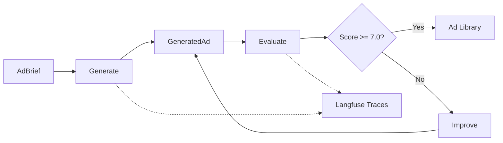

# Autonomous Ad Engine

Self-improving ad copy generation pipeline for Varsity Tutors SAT prep. Generates Facebook/Instagram ads, scores them with an LLM judge across 5 quality dimensions, and iteratively improves weak areas until they pass a quality threshold.

## Quick Start

```bash
git clone <repo-url> && cd ad-engine
python3 -m venv .venv && source .venv/bin/activate
pip install -r requirements.txt
cp .env.example .env   # add your API keys
python -m output.batch_runner --num-ads 10
```

## Architecture



**Four stages:**

1. **Generate** -- Gemini produces ad copy from a brief (audience, goal, offer, hook style)
2. **Evaluate** -- LLM judge scores the ad on 5 dimensions independently
3. **Improve** -- Weakest dimension identified, targeted reprompt or few-shot injection fixes it
4. **Observe** -- Every LLM call traced to Langfuse with token counts, latency, and cost

## How It Works

Each ad goes through a generate-evaluate-improve loop. The evaluator scores 5 dimensions (clarity, value proposition, CTA, brand voice, emotional resonance) using weighted averages. If the aggregate score is below 7.0, the system identifies the weakest dimension and regenerates with targeted feedback. This repeats up to 3 times, escalating the improvement strategy each cycle.

## Project Structure

```
ad-engine/
├── config/
│   ├── config.yaml           # Dimensions, weights, threshold, brand voice
│   ├── loader.py             # Config + Gemini client singleton
│   └── observability.py      # Langfuse/OTEL tracing (graceful degradation)
├── generate/
│   ├── models.py             # Pydantic models (AdBrief, GeneratedAd, AdRecord, etc.)
│   ├── generator.py          # Ad generation via Gemini
│   ├── briefs.py             # Brief matrix generation (3 segments x 2 goals x 3 offers x 3 tones)
│   └── prompts/
│       └── generator_prompt.yaml
├── evaluate/
│   ├── judge.py              # LLM-as-judge scoring
│   ├── dimensions.py         # Rubric definitions per dimension
│   ├── calibration.py        # Judge calibration against reference ads
│   └── prompts/
│       └── judge_prompt.yaml
├── iterate/
│   ├── feedback.py           # Core pipeline loop (generate -> evaluate -> improve)
│   └── strategies.py         # Targeted reprompt, few-shot injection, model escalation
├── output/
│   ├── batch_runner.py       # CLI batch orchestrator with progress bar
│   └── generate_report.py    # Markdown report from batch results
├── compete/references/       # Reference ads and competitor patterns
├── data/                     # Generated artifacts (ad_library.json, batch_summary.json)
├── tests/                    # 15+ pytest tests
└── docs/
    ├── decision_log.md       # Design decisions with rationale and outcomes
    └── limitations.md        # Known limitations and what I'd do differently
```

## Configuration

Edit `config/config.yaml` to change:

| Setting | Default | Description |
|---------|---------|-------------|
| `models.generator` | `gemini-3.1-flash-lite-preview` | Model for ad generation |
| `models.evaluator` | `gemini-3.1-flash-lite-preview` | Model for judge scoring |
| `quality.threshold` | `7.0` | Minimum aggregate score to pass |
| `quality.max_regeneration_attempts` | `3` | Max improvement cycles per ad |

Dimension weights: clarity (0.25), value_proposition (0.25), call_to_action (0.20), brand_voice (0.15), emotional_resonance (0.15).

## Entry Points

| Command | Description |
|---------|-------------|
| `python -m output.batch_runner --num-ads 54` | Full batch generation run |
| `python -m output.generate_report` | Markdown report from batch data |
| `python -m generate.briefs` | Generate and save brief matrix |
| `python -m evaluate.calibration` | Run judge calibration against reference ads |

## Running Tests

```bash
pytest tests/ -v
```

15+ tests covering Pydantic validation, config loading, dimension rubrics, brief generation, and pipeline logic (with mocked LLM calls).

## Batch Results

From the most recent 53-ad batch:

| Metric | Value |
|--------|-------|
| Total ads | 53 |
| Pass rate | 100% |
| Avg aggregate score | 7.59 |
| Score range | 7.00 -- 8.85 |
| Avg iterations per ad | 2.23 |
| Total cost | $2.35 |
| Cost per ad | $0.044 |

Per-dimension averages: clarity 8.42, value_proposition 7.70, brand_voice 7.91, call_to_action 6.98, emotional_resonance 6.51.

## Cost Estimate

Using `gemini-3.1-flash-lite-preview` at $1.25/1M input tokens and $10.00/1M output tokens:

- ~$0.044 per ad (including all evaluation and improvement cycles)
- ~$2.35 for a 53-ad batch
- Evaluation is the primary cost driver (5 LLM calls per evaluation, ~2.2 evaluations per ad)

## Key Design Decisions

See [docs/decision_log.md](docs/decision_log.md) for the full log. Highlights:

- Evaluator built before generator (can't improve what you can't measure)
- Single cheap model for both gen and eval (10x cost savings vs. Pro)
- Relaxed character limits (let the evaluator handle length, not hard validation)
- Three-tier improvement escalation (reprompt -> few-shot -> model upgrade)

## Limitations

See [docs/limitations.md](docs/limitations.md). The biggest ones:

- Self-evaluation bias (same model family for gen + eval)
- 100% pass rate suggests the threshold or judge may be too lenient
- emotional_resonance consistently scores lowest (6.51 avg) and doesn't improve much through iteration
- No caching, no A/B test integration, no human approval step
