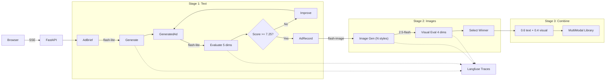

# Autonomous Ad Engine

Self-improving ad generation pipeline for Varsity Tutors SAT prep. Generates Facebook/Instagram ads with AI-generated creative images, scores them with LLM judges across text (5 dimensions) and visual (4 dimensions) quality, iteratively improves weak areas, and auto-selects the best image variant from multiple styles. Ships with a streaming web dashboard deployed to Railway.

## Quick Start

```bash
git clone <repo-url> && cd ad-engine
python3 -m venv .venv && source .venv/bin/activate
pip install -r requirements.txt
cp .env.example .env   # add your API keys

# Web dashboard
uvicorn server:app --reload

# Or CLI batch run
python -m output.batch_runner --num-ads 10
```

## Architecture



**Three stages, streamed to the browser over SSE:**

1. **Text (v1)** -- Gemini flash-lite generates ad copy, evaluates across 5 dimensions, and iteratively improves weak areas (up to 3 cycles with strategy escalation)
2. **Images (v2)** -- Nano Banana 2 generates image variants across multiple styles, Gemini 2.5 Flash evaluates each on 4 visual dimensions, and the best variant is auto-selected
3. **Combine** -- Text and visual scores are blended (60/40) into a combined score; the full multimodal record is saved to the library

Every LLM call is traced to Langfuse with token counts, latency, and cost. The web dashboard (FastAPI + Jinja2 + Tailwind/DaisyUI) renders each pipeline stage incrementally — ad copy and scores stream in real time, then image variants appear as they're generated.

## How It Works

Each ad goes through a generate-evaluate-improve loop. The text evaluator scores 5 dimensions (clarity, value proposition, CTA, brand voice, emotional resonance) using weighted averages. If the aggregate score is below 7.25, the system identifies the weakest dimension and regenerates with targeted feedback. This repeats up to 3 times, escalating the improvement strategy each cycle (targeted reprompt → few-shot injection → model escalation to 2.5 Flash).

Once the text passes, the multimodal pipeline generates image variants across up to 8 styles (photorealistic, ugc_style, illustration, minimal_graphic, hero_photo, infographic, typography_checklist, comic_panel). Each image is evaluated by a visual judge across 4 dimensions (brand consistency, engagement potential, text-image coherence, technical quality). The best variant is auto-selected using visual scores with a goal-aware tiebreaker (hero_photo for conversion, ugc_style for awareness). A combined score (0.6 × text + 0.4 × visual) determines the final ranking.

## Project Structure

```
ad-engine/
├── server.py                    # FastAPI app — SSE endpoints (text + multimodal), Jinja2 templates
├── Procfile                     # Railway deployment (uvicorn)
├── templates/
│   └── index.html               # Dashboard UI (Tailwind + DaisyUI + Chart.js)
├── static/
│   └── app.js                   # Client-side SSE parsing, Chart.js radar rendering
├── config/
│   ├── config.yaml              # Dimensions, weights, thresholds, brand voice, image gen config
│   ├── loader.py                # Config + Gemini client singleton
│   └── observability.py         # Langfuse/OTEL tracing (graceful degradation)
├── generate/
│   ├── models.py                # Pydantic models (AdBrief, GeneratedAd, VisualEvaluation, MultiModalAdRecord, etc.)
│   ├── generator.py             # Text ad generation via Gemini flash-lite
│   ├── briefs.py                # Brief matrix generation (9 segments × 2 goals × offers × tones)
│   ├── image_generator.py       # Image generation via Nano Banana 2 + PIL text overlay
│   ├── ab_variants.py           # A/B variant generation, evaluation, and selection
│   ├── prompts/
│   │   └── generator_prompt.yaml
│   └── image_prompts/
│       ├── templates.yaml       # YAML prompt templates (8 styles, 9 audiences, placements)
│       └── prompt_builder.py    # Prompt assembly from templates
├── evaluate/
│   ├── judge.py                 # Text LLM-as-judge scoring (5 dimensions)
│   ├── dimensions.py            # Text rubric definitions per dimension
│   ├── calibration.py           # Judge calibration against reference ads
│   ├── prompts/
│   │   └── judge_prompt.yaml
│   └── visual/
│       ├── rubrics.py           # Visual scoring rubrics (4 dimensions)
│       └── image_judge.py       # Image evaluation via Gemini 2.5 Flash
├── iterate/
│   ├── feedback.py              # Text pipeline loop (generate → evaluate → improve)
│   ├── strategies.py            # Targeted reprompt, few-shot injection, model escalation
│   └── multimodal_pipeline.py   # End-to-end multimodal pipeline + batch runner
├── output/
│   ├── batch_runner.py          # Text-only CLI batch orchestrator
│   ├── generate_report.py       # Markdown report from batch results
│   └── visualize.py             # Quality trend charts (v1 text + v2 multimodal)
├── compete/references/          # Reference ads and competitor patterns
├── data/
│   ├── ad_library.json          # Text-only ad library
│   ├── multimodal_ad_library.json  # Multimodal ad library (text + images)
│   └── images/                  # Generated ad images
├── tests/                       # 33+ pytest tests (v1 text + v2 multimodal)
└── docs/
    ├── decision_log.md          # 16 design decisions with rationale and outcomes
    ├── limitations.md           # Known limitations (v1 + v2) and what I'd do differently
    └── demo_script.md           # Demo video script
```

## Configuration

Edit `config/config.yaml` to change:

| Setting | Default | Description |
|---------|---------|-------------|
| `models.generator` | `gemini-3.1-flash-lite-preview` | Model for text ad generation |
| `models.evaluator` | `gemini-3.1-flash-lite-preview` | Model for text judge scoring |
| `models.escalation` | `gemini-2.5-flash` | Model for tier 3 improvement escalation |
| `quality.threshold` | `7.25` | Minimum text aggregate score to pass |
| `quality.max_regeneration_attempts` | `3` | Max improvement cycles per ad |
| `image_generation.model` | `gemini-3.1-flash-image-preview` | Image generation model (Nano Banana 2) |
| `image_generation.variants_per_ad` | `4` | Number of image variants per ad |
| `image_generation.default_resolution` | `1K` | Image resolution (512, 1K, 2K, 4K) |
| `image_generation.text_overlay_mode` | `programmatic` | `programmatic` (PIL) or `ai` (in-image) |
| `visual_evaluation.model` | `gemini-2.5-flash` | Model for visual evaluation |
| `visual_evaluation.threshold` | `7.0` | Minimum visual aggregate score to pass |

Text dimension weights: clarity (0.25), value_proposition (0.25), call_to_action (0.20), brand_voice (0.15), emotional_resonance (0.15).

Visual dimension weights: brand_consistency (0.30), engagement_potential (0.30), text_image_coherence (0.25), technical_quality (0.15).

## Entry Points

| Command | Description |
|---------|-------------|
| `uvicorn server:app --reload` | Web dashboard (dev) — text + multimodal generation |
| `python -m iterate.multimodal_pipeline --num-ads 5` | Multimodal batch (text + images) |
| `python -m output.batch_runner --num-ads 54` | Text-only batch generation (CLI) |
| `python -m output.generate_report` | Markdown report from batch data |
| `python -m output.visualize` | Text quality trend charts |
| `python -m output.visualize --v2` | Multimodal quality trends + ad showcase |
| `python -m generate.briefs` | Generate and save brief matrix |
| `python -m evaluate.calibration` | Run judge calibration against reference ads |

## Multi-Model Orchestration

| Task | Model | Why |
|------|-------|-----|
| Text generation | `gemini-3.1-flash-lite-preview` | Cheapest, fast, proven in v1 (100% pass rate at $0.044/ad) |
| Text evaluation | `gemini-3.1-flash-lite-preview` | Same cheap model, calibration passed 8/8 |
| Text improvement (tier 3) | `gemini-2.5-flash` | Genuine model upgrade for stubborn cases |
| Image generation | `gemini-3.1-flash-image-preview` | Nano Banana 2 — only Gemini model that generates images |
| Visual evaluation | `gemini-2.5-flash` | Flash-lite's vision is too weak for reliable image scoring |

## Running Tests

```bash
pytest tests/ -v
```

33+ tests covering Pydantic validation, config loading, dimension rubrics, brief generation, text pipeline logic, image prompt building, image generator utilities, visual evaluation, A/B variant selection, and multimodal pipeline logic (all with mocked LLM calls).

## Batch Results

**Text-only (v1)** — 53-ad batch:

| Metric | Value |
|--------|-------|
| Total ads | 53 |
| Pass rate | 100% |
| Avg aggregate score | 7.59 |
| Score range | 7.00 -- 8.85 |
| Avg iterations per ad | 2.23 |
| Total cost | $2.35 |
| Cost per ad | $0.044 |

Per-dimension averages: clarity 8.42, value_proposition 7.70, brand_voice 7.91, call_to_action 6.98, emotional_resonance 6.51.

## Cost Estimate

**Text-only (v1):** ~$0.044 per ad, ~$2.35 for a 53-ad batch. Evaluation is the primary cost driver.

**Multimodal (v2):** ~$0.29 per ad with 4 image variants at 1K resolution:

| Component | Model | Cost per unit | Units per ad | Cost per ad |
|-----------|-------|---------------|--------------|-------------|
| Text generation | flash-lite ($0.25/$1.50 per 1M) | ~$0.002 | 1-3 | ~$0.005 |
| Text evaluation | flash-lite ($0.25/$1.50 per 1M) | ~$0.004 | 1-3 | ~$0.008 |
| Text improvement | flash-lite / 2.5-flash (tier 3) | ~$0.003 | 0-2 | ~$0.005 |
| Image generation | Nano Banana 2 ($0.067/image at 1K) | ~$0.067 | 4 variants | ~$0.268 |
| Visual evaluation | 2.5-flash ($0.30/$2.50 per 1M) | ~$0.001 | 4 variants × 4 dims | ~$0.008 |
| **Total** | | | | **~$0.29** |

At 50 ads: ~$14.50 for a full multimodal batch. Image generation is ~84% of per-ad cost.

## Deployment

Deployed to **Railway** with a one-line Procfile. Environment variables (`GOOGLE_API_KEY`, `LANGFUSE_PUBLIC_KEY`, `LANGFUSE_SECRET_KEY`, `LANGFUSE_BASE_URL`) are configured in the Railway dashboard.

## Key Design Decisions

See [docs/decision_log.md](docs/decision_log.md) for the full log (16 entries). Highlights:

- Evaluator built before generator (can't improve what you can't measure)
- Single cheap model for text gen and eval (10x cost savings vs. Pro)
- Three-tier improvement escalation (reprompt → few-shot → model escalation to 2.5 Flash)
- Multi-model orchestration — cheapest model per task, upgrade only where there's a measurable quality gap
- Programmatic text overlay (PIL) as default — AI text rendering is unreliable, with style-specific overrides for styles that need integrated text
- 8 style approaches with 3 overlay behavior categories (no text, AI text, hero gradient)
- Visual eval threshold (7.0) lower than text (7.25) — image scoring is inherently noisier
- Combined score 60/40 text/visual — copy drives clicks, images stop the scroll
- SSE streaming over WebSockets — unidirectional is all we need, and it's native to FastAPI
- Railway deployment with zero-config Python deploys and SSE support

## Limitations

See [docs/limitations.md](docs/limitations.md). The biggest ones:

- Self-evaluation bias compounds across text and visual stages (Gemini judging Gemini output)
- Visual evaluation is noisier than text — scores can vary ±1 point across runs
- Image quality from Nano Banana 2 is inconsistent (artifacts, distorted hands, melted text)
- "Best variant" is LLM judgment, not real-world CTR data — no A/B test integration
- Image generation is ~84% of per-ad cost — draft-then-upscale optimization not yet implemented
- Single-process web app with no auth — not production-hardened
- Ad library stored as JSON on disk (ephemeral on redeploy)
